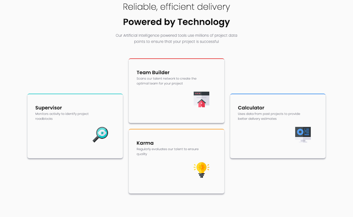

# Frontend Mentor - Four card feature section solution

This is a solution to the [Four card feature section challenge on Frontend Mentor](https://www.frontendmentor.io/challenges/four-card-feature-section-weK1eFYK). Frontend Mentor challenges help you improve your coding skills by building realistic projects.

## Table of contents

- [Overview](#overview)
  - [The challenge](#the-challenge)
  - [Screenshot](#screenshot)
  - [Links](#links)
- [My process](#my-process)
  - [Built with](#built-with)
  - [What I learned](#what-i-learned)
  - [Continued Development](#continued-development)
  - [Useful resources](#useful-resources)
- [Author](#author)

## Overview

### The challenge

Users should be able to:

- View the optimal layout for the site depending on their device's screen size

### Screenshot




### Links

- Github Repo URL: [Four Card Repo](https://github.com/amyspencerproject/four-card-feature)
- Live Site URL: [Four Card Page](https://amyspencerproject.github.io/four-card-feature/)

## My process

### Built with

- Semantic HTML5 markup
- CSS Variables
- CSS Grid
- Mobile-first workflow

### What I learned

- Chose to use CSS Grid as the layout for this challenge. The design has both rows and columns.
- In mobile view not sure if I need rows in the card container. And then I am not sure if I should make each card a grid element and use columns so place the icon or if I should just use a margin on the left to push the icon over.
- All the cards in the mobile view are sticking to the left. I tried a place content: center in the card-container but this does not have any affect at all.
- The cards in the desktop view are set at fixed columns and then a span 4. This makes the left not match the spacing on the right. I tried playing around with changing the width of the 12th column to be larger than the 1st column.

```
 grid-template-columns: 1rem repeat(10, 1fr) 15rem;
```

- Asked for some guidence on the FEM discord channel and got some great advice. Re-do it because your css is too complicated. Don't over think it.

- I stripped out all the stylings and all the columns and rows and started over

- Things I did wrong

  - Try to use extra columns as margins
  - Included the non-card text into the card-container
  - Set maxwiths on the cards
  - Not use gap spacing between columns and rows

- I did put the header section under a flex layout so that the size of the body-text could be constrained with a percentage i.e. the size of that div could be control by the content not the other way around

### Continued development

Thinking in CSS Grid is still difficult for me. There is another challenge on my list that Grace suggested was a good exercise for using Grid. I just need more practice.

### Useful resources

- [Autofill on Columns](https://css-tricks.com/an-auto-filling-css-grid-with-max-columns/) - I didn't use this for the final solution but it was an interesting read

## Author

- Website - [Amy Spencer](https://spencerproject.com/)
- Frontend Mentor - [@amyspencerproject](https://www.frontendmentor.io/profile/amyspencerproject)
- Linkedin - [amyspencercodes](https://www.linkedin.com/in/amyspencercodes/)
